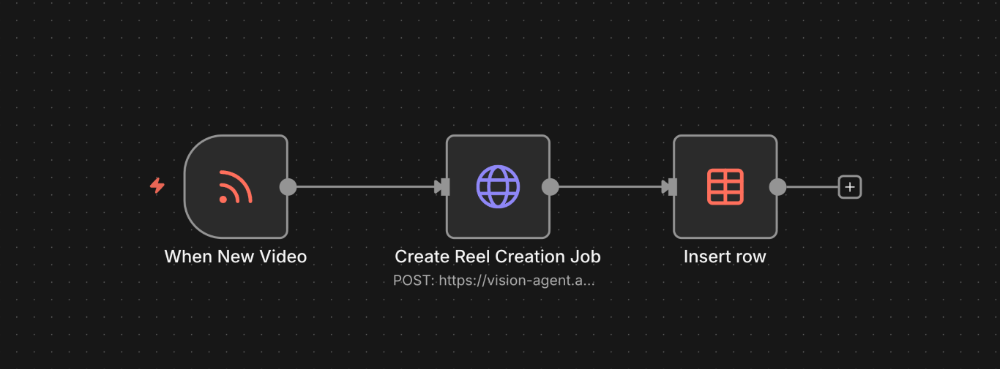
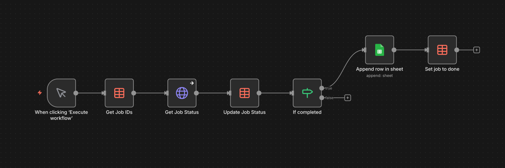

# Automatiser le clipping vidéo YouTube avec l'IA et n8n

Vous êtes créateur de contenu ou fan de shorts vidéo? Vous avez sûrement déjà vécu cette situation : une vidéo sort, vous repérez LE moment parfait à clipper, mais quand vous vous mettez au travail, 50 personnes l'ont déjà fait. La course contre la montre, on connaît tous.

Annie, une collègue passionnée de clipping, vivait ça quotidiennement. Je me suis donc posé la question: pourquoi ne pas laisser l'IA faire ce boulot dès qu'une vidéo est publiée?

Spoiler : ça fonctionne. Et je vous montre comment reproduire ce système gratuitement.

## Le concept

L'idée est simple : un flow surveille votre chaîne YouTube favorite, détecte les nouvelles vidéos, et génère automatiquement des clips optimisés pour les réseaux sociaux. Sans intervention humaine.

Le système repose sur :
- **n8n** : une plateforme d'automatisation open-source (gratuite)
- **Reka AI** : leur API Clips qui analyse et découpe les vidéos intelligemment
- **Votre boîte mail** : pour recevoir les clips prêts à poster

Trois étapes, zéro effort manuel, 100% gratuit.

## L'architecture technique

Le système se compose de deux workflows n8n complémentaires. Pensez-y comme deux employés qui bossent en tandem.

### Premier workflow : Le détecteur



Son job? Être à l'affût. Il scrute le flux RSS d'une chaîne YouTube. Nouvelle vidéo détectée? Il déclenche le processus :

- Extraction de l'URL
- Appel à l'API Reka avec vos instructions personnalisées
- Récupération d'un identifiant de tâche
- Stockage des infos dans une table n8n

La beauté de cette solution? Tout est paramétrable. Format vertical pour Instagram et TikTok, horizontal pour YouTube Shorts, carré pour d'autres plateformes. Sous-titres activés ou non. Durée du clip modulable de 0 à 30 secondes. Vous contrôlez tout via une simple
Vous pouvez personnaliser la façon dont les clips sont créés. Vous voulez des vidéos verticales pour TikTok? C'est fait. Besoin de sous-titres? Pas de problème. Vous pouvez définir la durée du clip entre 0 et 30 secondes. Tout est dans la configuration JSON.
Exemple de configuration :

```json
{
  "video_urls": ["{{ $json.link }}"],
  "prompt": "Identifie et extrait les passages les plus percutants de cette vidéo",
  "generation_config": {
    "template": "moments",
    "num_generations": 1,
    "min_duration_seconds": 0,
    "max_duration_seconds": 30
  },
  "rendering_config": {
    "subtitles": true,
    "aspect_ratio": "9:16"
  }
}
```

### Second workflow : Le vérificateur



Pendant que l'IA travaille (l'analyse peut prendre de quelques minutes à plus longtemps selon la vidéo), ce workflow vérifie l'avancement :

- Consultation régulière de la base de données pour les tâches en cours
- Interrogation de l'API : "C'est prêt?"
- Envoi d'un email dès qu'un clip est disponible
- Mise à jour du statut pour éviter les vérifications inutiles

Personnellement, je lance cette vérification toutes les 20 minutes. Inutile de harceler l'API toutes les 2 minutes—la patience est une vertu, même en automatisation.


## Mise en place pas à pas

La configuration prend moins de 10 minutes. Vraiment. Annie l'a testée en direct lors de notre session d'enregistrement, et tout était opérationnel avant même qu'on finisse nos cafés.

### Première étape : Préparez votre base de données

Direction n8n, créez une table de données. Petit piège à éviter : n'utilisez pas "videos" comme nom (vous me remercierez plus tard). Optez pour "clip_jobs", "youtube_reels" ou autre chose de descriptif.

Structure de la table - 4 colonnes (format texte) :
- `video_title` : titre de la vidéo YouTube
- `video_url` : lien direct
- `job_id` : identifiant fourni par Reka
- `job_status` : état d'avancement queued, processing, completed..
- `job_id` - L'ID que Reka nous donne pour suivre le clip

### Deuxième étape : Import des workflows

Récupérez les deux templates JSON sur GitHub, puis importez-les dans n8n. Normal qu'ils affichent des erreurs initialement—ils attendent d'être paramétrés.

### Troisième étape : Paramétrage du détecteur

**Flux RSS** : Indiquez l'ID de la chaîne YouTube à surveiller (trouvable dans l'URL de n'importe quelle chaîne).

**Authentification API** : Rendez-vous sur [platform.reka.ai](https://link.reka.ai/free) pour obtenir votre clé gratuite. Collez-la dans le champ Bearer Auth. Nommez-la explicitement pour vous y retrouver.

**Instructions pour l'IA** : Définissez vos critères de clipping. Par défaut, vous obtenez du 9:16 (format vertical) de 30 secondes max avec sous-titres. Mais modifiez selon vos besoins :
   - Rédigez votre propre prompt
   - Ajustez la durée minimale et maximale
   - Choisissez le format (1:1, 9:16, 16:9...)
   - Activez/désactivez les sous-titres

**Connexion base de données** : Liez ce workflow à votre table créée précédemment.

### Quatrième étape : Paramétrage du vérificateur

**Déclencheur** : Testez d'abord manuellement. Une fois validé, programmez des vérifications automatiques (intervalle recommandé : 15-30 minutes).

**Authentification** : Même clé API Reka que précédemment.

**Notification** : Configurez le nœud email avec votre adresse. Le template par défaut est efficace, mais personnalisez si vous le souhaitez.

**Base de données** : Vérifiez que tous les nœuds référencent bien votre tablesi vous voulez, mais celui par défaut fonctionne très bien.

## Démonstration vidéo

Toute la procédure est filmée avec Annie qui configure le système en temps réel. Chaque clic, chaque paramètre, même nos petites galères—tout est dedans. C'est brut, c'est authentique, et ça montre que vraiment, n'importe qui peut le faire. La vidéo est en anglais, n'hésitez pas à partager vos questions en commantaires, s'il y a de l'intérêt je ferai une version française.

<iframe width="560" height="315" src="https://www.youtube.com/embed/6YV6K94m_FA?si=USYShbAkB-upT12I" title="YouTube video player" frameborder="0" allow="accelerometer; autoplay; clipboard-write; encrypted-media; gyroscope; picture-in-picture; web-share" referrerpolicy="strict-origin-when-cross-origin" allowfullscreen></iframe>

## Pour conclure

Cet outil fonctionne à merveille, que vous soyez un passionné de clipping ou un créateur de contenu qui veut générer des clips pour sa propre chaîne. Une fois configuré, ça roule tout seul. Une nouvelle vidéo sort à 3h du matin? Votre clip est déjà en traitement. Vous vous réveillez avec un lien de téléchargement dans votre boîte de réception.

C'est open source et gratuit. Prenez-le, personnalisez-le, faites-en votre affaire. Et si vous avez des améliorations ou des idées, j'adorerais en entendre parler. Partagez vos mises à jour sur [GitHub](https://link.reka.ai/n8n-clip) ou rejoignez la conversation sur le [Discord de la communauté Reka](https://link.reka.ai/discord) .Ou contactez-moi directement, je réponds toujours.

## Ressources et liens utiles

Pour démarrer immédiatement :

🔗 [Templates n8n sur GitHub](https://link.reka.ai/n8n-clip)  
🔗 [Clé API Reka (gratuite)](https://link.reka.ai/free  )

