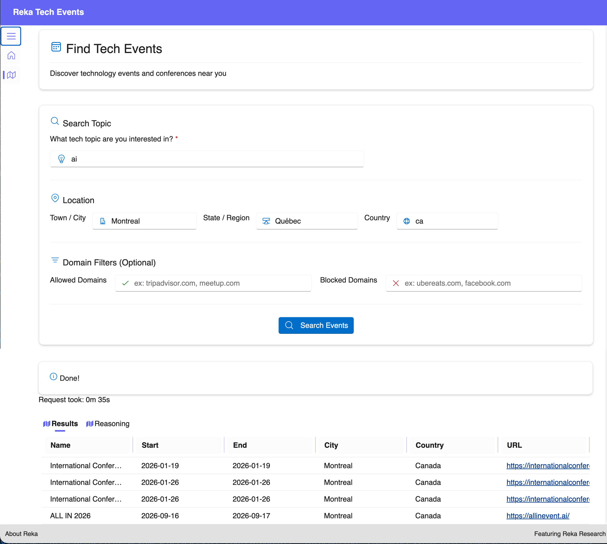

# D'heures à minutes: une IA qui trouve des événements techno pour vous

#### TL;DR

J'ai construit un agent de recherche IA qui navigue réellement le web en direct et trouve des événements techno—aucune boucle de recherche, aucune logique de réessai, aucune hallucination. Posez simplement une question et obtenez un JSON structuré avec les étapes de raisonnement incluses. Le secret? Une API qui gère automatiquement la recherche en plusieurs étapes. Construit avec .NET/Blazor en une fin de semaine. [Regardez-moi le construire](https://www.youtube.com/watch?v=ML-9SrQm2Dk) | [Obtenez le code](https://link.reka.ai/event-finder-dotnet) | [Clé API gratuite](https://link.reka.ai/free)

Bonne année! Je voulais partager quelque chose que j'ai récemment présenté à la conférence AI Agents 2025: comment construire des assistants de recherche intelligents qui peuvent chercher sur le web en direct et retourner des résultats structurés et fiables.

En revenant des vacances, je suis rappelé d'un problème universel: la surcharge d'informations. Que ce soit pour trouver des conférences techno pertinentes, rattraper les nouvelles de l'industrie, ou parcourir des piles de documentation accumulée pendant le congé, nous avons tous besoin d'outils qui peuvent rapidement rechercher et synthétiser l'information pour nous. C'est ce que fait Reka Research—c'est une IA agentique qui navigue le web (ou vos documents privés), répond à des questions complexes, et transforme des heures de recherche en minutes. J'ai construit une démo pratique pour montrer cela en action: un chercheur d'événements qui recherche sur internet en direct les prochaines conférences techno.

La présentation complète est disponible sur YouTube si vous voulez suivre: [How to Build Agentic Web Research Assistants](https://www.youtube.com/watch?v=ML-9SrQm2Dk)

## Le problème: Trouver des événements n'est pas qu'une simple recherche

Laissez-moi vous dresser le tableau. Vous voulez trouver des conférences techno sur l'IA dans votre région (ou ailleur). Vous avez besoin d'informations spécifiques: le nom de l'événement, les dates de début et de fin, l'emplacement, et surtout, l'URL d'inscription.

Une simple recherche web ou requête LLM de base ne suffit pas parce que:

- Vous pourriez obtenir des informations dépassées
- Le premier résultat de recherche contient rarement tous les détails requis
- Vous devez croiser plusieurs sources
- Sans structure, les données sont difficiles à utiliser dans une application

C'est là que l'API Research de Reka brille. Elle ne fait pas que chercher—elle raisonne à travers plusieurs étapes, agrège l'information, et retourne des résultats structurés et fondés.



## La solution: Une recherche en plusieurs étapes qui fonctionne réellement

L'innovation centrale ici est l'ancrage en plusieurs étapes. Au lieu de faire une seule requête en espérant pour le mieux, l'API Research agit comme un chercheur humain diligent:

1. Elle fait une recherche initiale basée sur votre requête
2. Vérifie quelle information manque
3. Effectue des recherches ciblées additionnelles
4. Agrège et valide les données
5. Retourne une réponse complète et structurée

En tant que développeur, vous envoyez simplement votre question, et l'API gère l'itération complexe. Pas besoin de construire vos propres boucles de recherche ou logique de réessai.

## Comment ça fonctionne: L'expérience développeur

Voici ce qui m'a le plus surpris: la simplicité. Vous définissez votre structure de données, posez une question, et l'API gère toute l'orchestration de recherche complexe. Aucune logique de réessai, aucune gestion de boucle de recherche.

La clé est la sortie structurée. Au lieu d'analyser du texte désordonné, vous dites exactement à l'API quel schéma JSON vous voulez:

```csharp
public class TechEvent
{
    public string? Name { get; set; }
    public DateTime? StartDate { get; set; }
    public DateTime? EndDate { get; set; }
    public string? City { get; set; }
    public string? Country { get; set; }
    public string? Url { get; set; }
}
```

Ensuite, vous envoyez votre requête avec le schéma, et elle retourne des données parfaitement structurées à chaque fois. L'API utilise un format compatible OpenAI, donc si vous avez travaillé avec l'API de ChatGPT, ça vous semblera instantanément familier.

La vraie magie? Vous obtenez aussi les étapes de raisonnement en retour—les recherches web réelles qu'elle a effectuées et comment elle est arrivée à la réponse. Parfait pour déboguer et comprendre le processus de pensée de l'agent.

Je parcours l'implémentation complète, incluant le filtrage de domaine, la recherche géolocalisée, et la gestion des appels de recherche asynchrones dans la [vidéo](https://www.youtube.com/watch?v=ML-9SrQm2Dk). Le [code source complet](https://link.reka.ai/event-finder-dotnet) est sur GitHub si vous voulez approfondir.

## Essayez-le vous-même

Le [code source complet](https://link.reka.ai/event-finder-dotnet) est sur GitHub. Clonez-le, obtenez une [clé API gratuite](https://link.reka.ai/free), et vous l'aurez en fonction en moins de 5 minutes.

Je suis curieux de voir ce que vous allez construire avec ceci. Des agents de recherche qui surveillent les nouvelles? Des outils de comparaison de produits? Des synthétiseurs de documentation? L'API fonctionne pour n'importe quelle tâche de recherche web. Si vous construisez quelque chose, identifiez-moi—j'aimerais le voir.

Bonne année! 🎉
