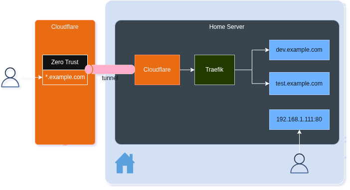

J'adore le cloud, en fait la plupart des gens me connaissent probablement grâce à mon contenu partagé à ce sujet. Mais parfois, nos applications n'ont pas besoin de mise à l'échelle ou de redondance. Parfois, on veut simplement les héberger quelque part.

C'était les vacances, et pendant mon congé, j'ai travaillé sur quelques petits projets personnels. Je les ai empaquetés dans des conteneurs pour faciliter le déploiement n'importe où. Je les ai déployés sur un mini PC que j'ai à la maison et c'est génial... tant que je reste à la maison. Mais que faire si je veux y accéder depuis ailleurs (ex. : la maison de mes beaux parents) ?

J'ai configuré un beau tunnel Cloudflare vers un conteneur Traefik qui achemine le trafic vers le bon conteneur selon le préfixe ou le domaine de second niveau. Donc `dev.c5m.ca` va au conteneur X et `test.c5m.ca` va au conteneur Y. Dans ce billet, je voulais partager comment je l'ai fait (et aussi l'avoir quelque part pour moi au cas où j'aurais besoin de le refaire 😉). C'est simple une fois qu'on sait comment toutes les pièces fonctionnent ensemble.

## La configuration

L'architecture est simple : Cloudflare Tunnel crée une connexion sécurisée de mon réseau domestique vers le réseau périphérique de Cloudflare, et Traefik agit comme un proxy inverse qui route dynamiquement les requêtes entrantes vers le conteneur approprié selon le sous-domaine. De cette façon, je peux accéder à plusieurs services via différents sous-domaines sans exposer mon réseau domestique directement à Internet.

## Étape 1 : Cloudflare Tunnel

D'abord, en supposant que vous possédez déjà un nom de domaine, vous devrez créer un tunnel Cloudflare. Vous pouvez le faire via le tableau de bord Cloudflare sous Zero Trust → Networks → Tunnels. Une fois créé, vous obtiendrez un jeton de tunnel que vous utiliserez dans la configuration.

Voici mon `cloudflare-docker-compose.yaml` :

```yaml
name: cloudflare-tunnel

services:
  cloudflared:
    image: cloudflare/cloudflared:latest
    container_name: cloudflared
    restart: unless-stopped
    env_file:
      - .env
    environment:
      - TUNNEL_TOKEN=${TUNNEL_TOKEN}
    command: ["tunnel", "--no-autoupdate", "run", "--token", "${TUNNEL_TOKEN}"]
```

Le jeton de tunnel est stocké dans un fichier `.env` pour la sécurité. Le drapeau `--no-autoupdate` empêche le conteneur d'essayer de se mettre à jour automatiquement, ce qui est utile dans un environnement contrôlé.

## Étape 2 : Configuration DNS

Dans le tableau de bord Cloudflare, créez un enregistrement `CNAME` avec un caractère générique `*.c5m.ca`.

## Étape 3 : Configuration Traefik

Traefik est le proxy inverse qui routera le trafic vers vos conteneurs. J'ai deux fichiers de configuration : un pour Traefik lui-même et un pour la configuration Docker Compose.

Voici mon `traefik.yaml` :

```yaml
global:
  checkNewVersion: false
  sendAnonymousUsage: false

api:
  dashboard: false #true
  insecure: true

entryPoints:
  web:
    address: :8082
  websecure:
    address: :8043

providers:
  docker:
    endpoint: "unix:///var/run/docker.sock"
    exposedByDefault: false 
```

J'ai configuré deux points d'entrée : `web` sur le port 8082 (HTTP) et `websecure` sur le port 8043 (HTTPS). Je l'ai fait ainsi parce que les ports par défaut 80 et 443 étaient déjà pris. Le fournisseur Docker surveille les conteneurs avec des étiquettes Traefik et configure automatiquement le routage. `exposedByDefault: false` signifie que les conteneurs ne seront pas exposés à moins d'être explicitement activés avec des étiquettes. Vous n'aurez pas à modifier la configuration Traefik pour ajouter plus de conteneurs, tout est dynamique.

Et voici le `traefik-docker-compose.yaml` :

```yaml
name: traefik

services:
  traefik:
    image: "traefik:v3.4"
    container_name: "traefik-app"
    restart: unless-stopped
    networks:
      - proxy

    ports:
      - "8888:8080" # Dashboard port
      - "8082:8082"
      - "8043:8043" # remap 443
    volumes:
      - "/var/run/docker.sock:/var/run/docker.sock:ro"
      - "./config/traefik.yaml:/etc/traefik/traefik.yaml:ro"

networks:
  proxy:
    name: proxy
```

Les points clés ici :
- Traefik est connecté à un réseau Docker appelé `proxy` qui sera partagé avec d'autres conteneurs. Vous pouvez le nommer comme vous voulez.
- Le port 8888 mappe au tableau de bord de Traefik (actuellement désactivé dans la config)
- Les ports 8082 et 8043 sont exposés pour le trafic HTTP et HTTPS
- La socket Docker est montée en lecture seule pour que Traefik puisse découvrir les conteneurs
- Le fichier de configuration est monté depuis `./config/traefik.yaml`

## Étape 4 : Configuration des services

Maintenant, tout conteneur que vous voulez exposer via Traefik doit :
1. Être sur le même réseau `proxy`
2. Avoir des étiquettes Traefik configurées

Voici un exemple simple avec un conteneur nginx (`nginx-docker-compose.yaml`) :

```yaml
name: "test-tools"

services:
  nginx:
    image: "nginx:latest"
    container_name: "nginx-test"
    restart: unless-stopped
    networks:
      - proxy
    volumes:
      - "./html:/usr/share/nginx/html:ro"
      
    labels:
      - traefik.enable=true
      - traefik.http.routers.nginxtest.rule=Host(`test.c5m.ca`) 
      - traefik.http.routers.nginxtest.entrypoints=web

networks:
  proxy:
    external: true
```

Les étiquettes indiquent à Traefik :
- `traefik.enable=true` : Ce conteneur devrait être exposé
- `nginxtest` est le nom __unique__ pour router ce conteneur.
- `traefik.http.routers.nginxtest.rule=Host(...)` : Router les requêtes pour `test.c5m.ca` vers ce conteneur
- `traefik.http.routers.nginxtest.entrypoints=web` : Utiliser le point d'entrée `web` (port 8082)

## Bonus : Un exemple plus complexe

Pour un scénario plus réaliste, partageons comment je pourrais exposer [2D6 Dungeon App](https://github.com/FBoucher/2d6-dungeon-app). C'est un projet qui utilise Aspire, donc c'est facile à déployer comme on veut, où on veut.
Voici une version simplifiée de mon `2d6-docker-compose.yaml` qui inclut une application multi-conteneurs :

```yaml
name: 2d6-dungeon

services:
  database:
    container_name: 2d6_db
    ports:
      - "${MYSQL_PORT:-3306}:3306"
    networks:
      - proxy
    ...

  dab:
    container_name: 2d6_dab
    ...
    depends_on:
      database:
        condition: service_healthy
    ports:
      - "${DAB_PORT:-5000}:5000"
    networks:
      - proxy

  webapp:
    container_name: 2d6_app
    depends_on:
      - dab
    environment:
      ConnectionStrings__dab: http://dab:5000
      services__dab__http__0: http://dab:5000

    labels:
      - traefik.enable=true
      - traefik.http.routers.twodsix.rule=Host(`2d6.c5m.ca`)
      - traefik.http.routers.twodsix.entrypoints=web,websecure
      - traefik.http.services.twodsix.loadbalancer.server.port=${WEBAPP_PORT:-8080}

    networks:
      - proxy

    ports:
      - "${WEBAPP_PORT:-8080}:${WEBAPP_PORT:-8080}"

networks:
  proxy:
    external: true
```

Cet exemple montre :
- Plusieurs services qui fonctionnent ensemble (base de données, API, application web)
- Seule l'application web est exposée via Traefik (la base de données et l'API sont internes)
- L'application web utilise les deux points d'entrée `web` et `websecure`
- Note importante ici : les conteneurs faisant partie du même réseau peuvent utiliser leur port interne (ex. : 5000 pour DAB, 3306 pour MySQL)
- Le réseau externe est le `proxy` créé précédemment

## Configuration du tunnel Cloudflare

Dans votre tableau de bord Cloudflare, vous devrez configurer le tunnel pour acheminer le trafic vers Traefik. Créez un nom d'hôte public pointant vers `http://<ip-locale>:8082`. Utilisez l'adresse IP locale de votre serveur, quelque chose comme "192.168.1.123". Vous pouvez utiliser des caractères génériques comme `*.c5m.ca` pour acheminer tous les sous-domaines vers Traefik, qui gérera ensuite le routage selon le nom d'hôte.

## Conclusion

C'est tout ! Une fois que tout est configuré :



1. Le tunnel Cloudflare crée une connexion sécurisée de votre domicile vers Cloudflare
2. Le trafic arrive via Cloudflare et est routé vers Traefik
3. Traefik lit le nom d'hôte et route vers le conteneur approprié
4. Chaque service peut être accessible via son propre sous-domaine
5. Seuls les conteneurs avec les étiquettes Traefik sont accessibles depuis l'extérieur de mon réseau

C'est une configuration simple qui fonctionne très bien pour les projets personnels. Le meilleur aspect est que vous n'avez pas besoin d'exposer de ports sur votre routeur ou de gérer le DNS dynamique, Cloudflare s'occupe de tout ça.

La prochaine étape sera d'ajouter de l'authentification et de l'autorisation (ex. : en utilisant Keycloak), mais c'est pour un autre billet. Pour l'instant, cela me donne un moyen d'accéder à mes services hébergés à la maison depuis n'importe où, et j'ai pensé que ça pourrait être utile à partager.


