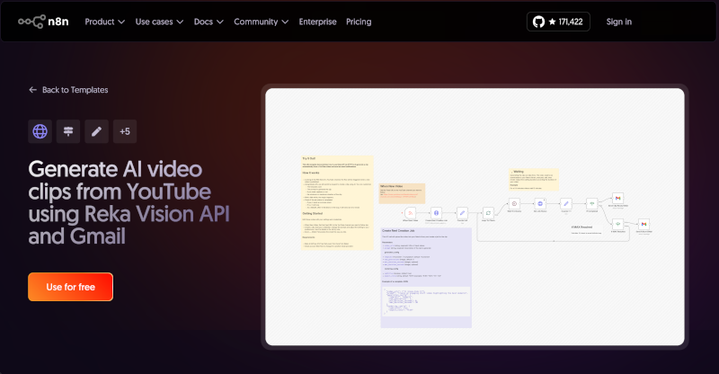

# Créez automatiquement des clips IA avec ce template n8n

Je suis ravi de partager que mon nouveau template n8n a été approuvé et est maintenant disponible pour tout le monde! Ce template automatise le processus de création de clips vidéo générés par AI à partir de vidéos YouTube et envoie des notifications directement dans votre boîte courriel.

**Essayez le template ici:** [https://link.reka.ai/n8n-template-api](https://link.reka.ai/n8n-template-api)

## Qu'est-ce que ce template fait?

Si vous avez toujours voulu créer automatiquement des courts clips à partir de longues vidéos YouTube, ce template est pour vous. Il surveille une chaîne YouTube de votre choix, et chaque fois qu'une nouvelle vidéo est publiée, il utilise l'AI pour générer des courts clips engageants parfaits pour les médias sociaux. Vous recevez une notification par courriel lorsque votre clip est prêt à télécharger.

## Comment ça fonctionne

Le flux de travail est simple et s'exécute complètement en pilote automatique:

1. **Surveiller les chaînes YouTube** - Le template surveille le flux RSS de n'importe quelle chaîne YouTube que vous spécifiez. Lorsqu'une nouvelle vidéo apparaît, l'automation se déclenche.

1. **Demander la génération de clip AI** - En utilisant l'API Vision de Reka, le flux de travail envoie la vidéo pour traitement AI. Vous avez le contrôle complet sur la sortie:
   - Rédigez une instruction personnalisée pour guider l'AI sur le type de clip à créer
   - Choisissez d'inclure ou non des sous-titres
   - Définissez la durée minimale et maximale du clip

1. **Vérification intelligente du statut** - Lorsque les clips sont prêts, vous recevez un courriel de succès avec votre lien de téléchargement. Comme mesure de sécurité, si la tâche prend trop de temps, vous recevrez plutôt une notification d'erreur.

## Démarrer est facile

Le meilleur? Vous pouvez installer ce template en un seul clic depuis la [page des templates n8n](https://link.reka.ai/n8n-template-api). Aucune configuration complexe requise!

Après l'installation, vous n'aurez besoin que de deux choses rapides:

- Une clé API Reka AI gratuite ([obtenez la vôtre chez Reka](https://link.reka.ai/free))
- Un compte Gmail (ou utilisez n'importe quel fournisseur de courriel que vous aimez)

C'est tout! Le template est prêt à utiliser. Ajoutez simplement le flux RSS de votre chaîne YouTube, connectez votre clé API, et vous êtes prêt à commencer à générer des clips automatiquement. La configuration complète ne prend que quelques minutes.

Si vous avez des questions ou voulez partager ce que vous avez créé, rejoignez la [communauté Discord de Reka](https://link.reka.ai/discord). J'aimerais beaucoup savoir comment vous utilisez ce template!

## Regardez-le en action

Dans cette vidéo rapide, je vous montre comment installer et configurer le template n8n pour créer automatiquement le template n8n.

<iframe width="560" height="315" src="https://www.youtube.com/embed/SGAltjnBaF4?si=42-EpCEnra6Xwk8r" title="YouTube video player" frameborder="0" allow="accelerometer; autoplay; clipboard-write; encrypted-media; gyroscope; picture-in-picture; web-share" referrerpolicy="strict-origin-when-cross-origin" allowfullscreen></iframe>

Bon clipping!
