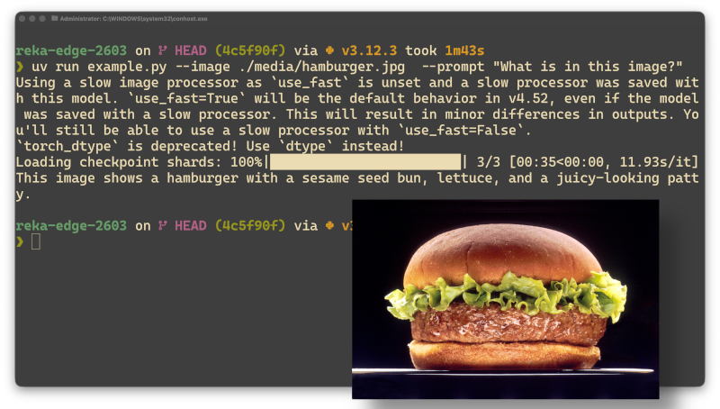

On a [lancé Reka Edge](https://reka.ai/news/reka-edge-frontier-level-edge-intelligence-for-physical-ai) la semaine dernière chez Reka, et j'avais envie de vous montrer comment le faire tourner. C'est un modèle de vision-langage, en gros, une IA à qui vous pouvez montrer une image ou une vidéo et poser des questions dessus. Ce qui le distingue : **tout se passe sur votre machine**. Pas de compte, pas de clé API, pas de données qui s'en vont quelque part sur un serveur.

J'ai eu beaucoup de plaisir à préparer ce guide. Ça devrait vous prendre une quinzaine de minutes, café compris.

## Ce dont vous avez besoin

- Une machine avec ~16 Go de RAM (assez pour un modèle 7b)
- Git
- [`uv`](https://docs.astral.sh/uv/), un gestionnaire de paquets Python vraiment rapide :
  ```bash
  curl -LsSf https://astral.sh/uv/install.sh | sh
  ```
  Ça fonctionne sur macOS, Linux et Windows via WSL. Si vous n'avez pas WSL, il y a aussi un [installateur Windows natif](https://docs.astral.sh/uv/getting-started/installation/).

## Étape 1 : Cloner le dépôt

Le modèle et le code d'inférence sont hébergés ensemble sur [Hugging Face](https://huggingface.co) :

```bash
git clone https://huggingface.co/RekaAI/reka-edge-2603
cd reka-edge-2603
```

## Étape 2 : Télécharger les poids du modèle

Hugging Face utilise Git LFS pour les gros fichiers. Après le clone, les poids du modèle ne sont pas encore là — seulement des fichiers pointeurs. Il faut les récupérer séparément.

Installez Git LFS si ce n'est pas déjà fait :

```bash
# macOS
brew install git-lfs

# Linux / WSL (Ubuntu/Debian)
sudo apt install git-lfs
```

Puis initialisez et tirez les fichiers :

```bash
git lfs install
git lfs pull
```

Les poids font plusieurs gigaoctets, alors c'est le bon moment pour aller chercher ce café.

## Étape 3 : Poser une question au modèle

Le dépôt vient avec des exemples médias dans `media/`. Pour analyser une image :

```bash
uv run example.py \
  --image ./media/hamburger.jpg \
  --prompt "What is in this image?"
```

Pour une vidéo, c'est le même principe avec `--video` :

```bash
uv run example.py \
  --video ./media/many_penguins.mp4 \
  --prompt "What is in this?"
```

Le modèle charge, traite votre fichier, et vous sort une description dans le terminal. Rien d'autre ne se passe — pas de requête réseau, pas de télémétrie.



**Quelques prompts intéressants à tester :**

- `"Describe this scene in detail."`
- `"What text is visible in this image?"`
- `"Is there anything unusual or unexpected here?"`

## Ce qui se passe sous le capot 

Vous n'avez pas besoin de lire ça pour utiliser le modèle, mais si vous êtes curieux comme moi, voici ce que `example.py` fait vraiment.

**1. Il détecte le meilleur accélérateur disponible.**
GPU Nvidia (CUDA), Apple Silicon (Metal), ou CPU en dernier recours. La qualité des réponses ne change pas, juste la vitesse.

```python
if torch.cuda.is_available():
    device = torch.device("cuda")
elif mps_ok:
    device = torch.device("mps")
else:
    device = torch.device("cpu")
```

**2. Il charge les poids en mémoire.**
Les 7 milliards de paramètres sont lus depuis le dossier cloné — ce sont des milliards de nombres qui encodent ce que le modèle a appris. Comptez environ 30 secondes selon votre matériel.

```python
processor = AutoProcessor.from_pretrained(args.model, trust_remote_code=True)
model = AutoModelForImageTextToText.from_pretrained(args.model, ...).eval()
```

**3. Il formate l'entrée comme une conversation.**
Votre image et votre texte sont combinés dans un message structuré, un peu comme un chat — sauf qu'un des éléments est visuel.

```python
messages = [{
    "role": "user",
    "content": [
        {"type": "image", "image": args.image},
        {"type": "text", "text": args.prompt},
    ],
}]
```

**4. Tout devient des chiffres.**
L'image est découpée en une grille de patches numériques, le texte est tokenisé. Le modèle ne travaille qu'avec des nombres — cette étape fait la conversion.

```python
inputs = processor.apply_chat_template(
    messages, tokenize=True, return_tensors="pt", return_dict=True
)
```

**5. La réponse se génère token par token.**
Le modèle prédit le prochain mot le plus probable, encore et encore, jusqu'à 256 tokens ou jusqu'à ce qu'il juge la réponse complète.

```python
output_ids = model.generate(**inputs, max_new_tokens=256, do_sample=False)
```

**6. Les tokens redeviennent du texte.**
Les identifiants numériques sont décodés et affichés dans votre terminal. Aucune connexion réseau à aucune étape.

```python
output_text = processor.tokenizer.decode(new_tokens, skip_special_tokens=True)
print(output_text)
```

## La suite

Un script, zéro dépendance cloud, et un modèle de vision de 7 milliards de paramètres qui tourne chez vous. Sur Mac, Linux, ou Windows avec WSL — c'est ce que j'utilisais quand j'ai écrit ce guide.

Utilisé comme ça, c'est déjà pratique pour des questions ponctuelles. Mais si vous voulez brancher ça dans une vraie application — une app web, un outil qui surveille un dossier, quelque chose qui appelle le modèle en boucle — un script de ligne de commande commence à montrer ses limites.

Dans le prochain article, je vais vous montrer comment exposer Edge comme une API locale. Même modèle, même confidentialité, mais accessible depuis n'importe quelle app sur votre machine.
