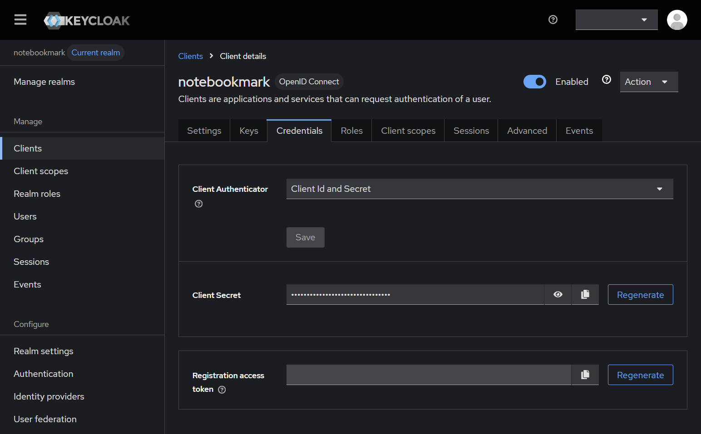
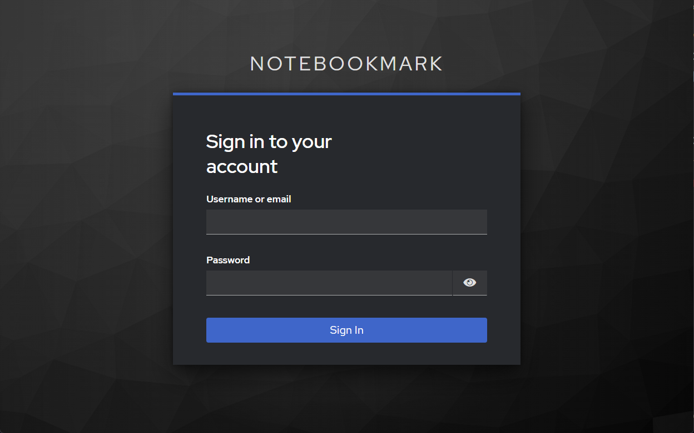
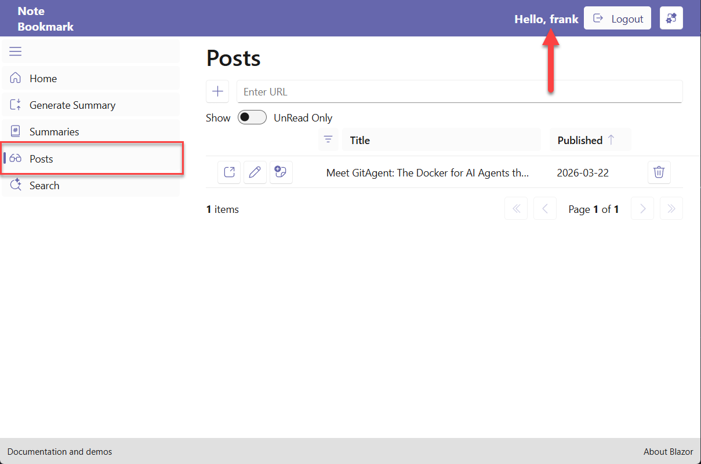

*À la fin de ce post, vous aurez un flux de connexion/déconnexion fonctionnel, appuyé par Keycloak, qui roule localement via Aspire et peut être déployé avec Docker Compose.*

Si votre application Aspire n'a pas encore d'authentification, c'est la voie la plus rapide vers un vrai fournisseur d'identité. Ce tutoriel vous guide à travers l'intégration de Keycloak OIDC dans une application .NET Aspire + Blazor Server existante: de l'enregistrement dans AppHost jusqu'à l'interface de connexion/déconnexion, en s'appuyant sur le code de production de **[NoteBookmark](https://github.com/fboucher/NoteBookmark)**, un gestionnaire de signets open source bâti avec .NET Aspire et Blazor.

## Étape 1: Ajouter Aspire.Hosting.Keycloak à AppHost

Aspire intègre nativement Keycloak via le paquet `Aspire.Hosting.Keycloak`. Ajoutez-le à votre projet AppHost :

Pour le projet AppHost
```bash
dotnet add package Aspire.Hosting.Keycloak
```

Ensuite, lancez `dotnet restore`.

## Étape 2: Enregistrer Keycloak dans AppHost.cs

Une fois le paquet installé, enregistrez Keycloak comme ressource dans votre AppHost. Aspire démarre un conteneur Keycloak, injecte ses détails de connexion dans les projets dépendants et s'assure que le démarrage se fait dans le bon ordre.

```csharp

// ...

// Ajouter le serveur d'authentification Keycloak
var keycloak = builder.AddKeycloak("keycloak", port: 8080)
    .WithDataVolume(); // Persiste les données Keycloak entre les redémarrages

if (builder.Environment.IsDevelopment())
{
    // ...

    builder.AddProject<NoteBookmark_BlazorApp>("blazor-app")
        // ...
        .WithReference(keycloak)  // <-- référence Keycloak
        .WaitFor(keycloak)  // <-- attend que Keycloak soit prêt
        .WithExternalHttpEndpoints()
        .PublishAsDockerComposeService((resource, service) =>
        {
            service.ContainerName = "notebookmark-blazor";
        });
}
```

### Changements clés :
- **`AddKeycloak("keycloak", port: 8080)`**: Enregistre une ressource Keycloak qui écoute sur le port 8080.
- **`WithDataVolume()`**: Persiste la configuration de Keycloak et les données de realm entre les redémarrages du conteneur. Sans ça, vous perdriez votre configuration à chaque arrêt du conteneur.
- **`.WithReference(keycloak)`**: Injecte les paramètres de connexion Keycloak (URL de base, etc.) dans BlazorApp sous forme de variables d'environnement.
- **`.WaitFor(keycloak)`**: Garantit que Keycloak est prêt avant le démarrage de Blazor. Si l'app démarre avant Keycloak, la découverte OIDC plante.

> **Note :** On ajoute la référence Keycloak seulement quand `IsDevelopment()` est vrai. Ainsi, votre environnement de développement se met en place tout seul à chaque démarrage, avec un conteneur Keycloak créé automatiquement.

## Étape 3: Configurer Keycloak pour les déploiements hors Aspire (prod)

Ce billet mise sur le développement avec Aspire, mais la production (Docker Compose, Kubernetes) exige un Keycloak autonome. Voici comment ça se présente et pourquoi.

Aspire peut d'ailleurs vous aider à faire la transition. `AddDockerComposeEnvironment()` dans AppHost génère un fichier Docker Compose préliminaire à partir de votre modèle Aspire, un excellent point de départ avant de personnaliser pour la production. Ça vaut le coup d'œil si vous voulez prendre de l'avance.

Les fichiers Compose finaux pour Keycloak et l'application NoteBookmark sont disponibles dans le [dépôt NoteBookmark](https://github.com/fboucher/NoteBookmark/tree/main/docker-compose) :

- [`keycloak-compose.yaml`](https://github.com/fboucher/NoteBookmark/blob/main/docker-compose/keycloak-compose.yaml): Keycloak + Postgres, avec support de certificats TLS
- [`note-compose.yaml`](https://github.com/fboucher/NoteBookmark/blob/main/docker-compose/note-compose.yaml): L'API NoteBookmark et l'application Blazor

Quelques points à retenir sur cette configuration :

- **Postgres comme base de données**: Keycloak utilise une instance Postgres dédiée (pas la base de données de l'application) pour persister la configuration du realm, les utilisateurs et les sessions.
- **Variables d'environnement via `.env`**: Les identifiants (`POSTGRES_USER`, `POSTGRES_PASSWORD`, `KEYCLOAK_USER`, `KEYCLOAK_PASSWORD`, `KEYCLOAK_URL`) sont sortis du fichier Compose et chargés depuis un fichier `.env` dans le même répertoire.
- **`KC_HTTP_ENABLED: "true"`**: Autorise le trafic HTTP en interne. En production, Keycloak est derrière un reverse proxy (nginx, Traefik) qui gère la terminaison TLS: HTTPS à l'extérieur, HTTP à l'intérieur.
- **`KC_FEATURES: "token-exchange"`**: Active la fonctionnalité d'échange de jetons, nécessaire si vous voulez des flux d'authentification service-à-service.
- **Réseau externe**: Les deux fichiers Compose partagent le même réseau Docker externe, permettant aux conteneurs de l'application d'atteindre Keycloak par son nom de conteneur.


## Étape 4: Configurer le Realm Keycloak et le client OIDC

Cette étape s'applique autant en développement qu'en production, mais une seule fois par environnement. En développement, `.WithDataVolume()` fait en sorte que la configuration Keycloak survit entre les sessions: vous configurez une fois, et c'est réglé.

Une fois Keycloak en marche, configurez-le :

1. Naviguez vers `http://localhost:8080` et connectez-vous avec vos identifiants d'administrateur.
2. Créez un nouveau realm :
   - Cliquez sur **Create Realm**
   - Nom: `notebookmark` (doit correspondre au realm dans votre URL d'autorité ci-dessous)
3. Créez un client OIDC :
   - Clients → **Create Client**
   - **Client ID**: `notebookmark`
   - **Client Protocol**: openid-connect
   - **Access Type**: confidential (génère un secret client)
   - **Valid Redirect URIs**: `http://localhost:5173/*` (ajustez selon l'URL de votre application Blazor)
   - **Web Origins**: `http://localhost:5173`
4. Allez dans l'onglet **Credentials** et copiez le **Client Secret**: vous en aurez besoin dans la configuration de votre application.



## Étape 5: Ajouter OpenID Connect à l'application Blazor

Place au pipeline d'authentification dans votre application Blazor Server.

### Ajouter le paquet NuGet

Pour le projet BlazorApp
```bash
dotnet add package Microsoft.AspNetCore.Authentication.OpenIdConnect
```

### Mettre à jour Program.cs

BlazorApp/Program.cs :
```csharp
using Microsoft.AspNetCore.Authentication;
using Microsoft.AspNetCore.Authentication.Cookies;
using Microsoft.AspNetCore.Authentication.OpenIdConnect;

//...

// Ajouter l'authentification
builder.Services.AddAuthentication(options =>
{
    options.DefaultScheme = CookieAuthenticationDefaults.AuthenticationScheme;
    options.DefaultChallengeScheme = OpenIdConnectDefaults.AuthenticationScheme;
})
.AddCookie(CookieAuthenticationDefaults.AuthenticationScheme)
.AddOpenIdConnect(OpenIdConnectDefaults.AuthenticationScheme, options =>
{
    var authority = builder.Configuration["Keycloak:Authority"];
    options.Authority = authority;
    options.ClientId = builder.Configuration["Keycloak:ClientId"];
    options.ClientSecret = builder.Configuration["Keycloak:ClientSecret"];
    options.ResponseType = "code";
    options.SaveTokens = true;
    options.GetClaimsFromUserInfoEndpoint = true;

    // Permet de remplacer RequireHttpsMetadata via la configuration.
    // Assouplit l'exigence en conteneur contre un Keycloak en HTTP.
    var requireHttpsConfigured = builder.Configuration.GetValue<bool?>("Keycloak:RequireHttpsMetadata");
    var isRunningInContainer = string.Equals(
        System.Environment.GetEnvironmentVariable("DOTNET_RUNNING_IN_CONTAINER"),
        "true",
        StringComparison.OrdinalIgnoreCase);

    if (requireHttpsConfigured.HasValue)
    {
        options.RequireHttpsMetadata = requireHttpsConfigured.Value;
    }
    else
    {
        var defaultRequireHttps = !builder.Environment.IsDevelopment();
        if (isRunningInContainer &&
            !string.IsNullOrEmpty(authority) &&
            authority.StartsWith("http://", StringComparison.OrdinalIgnoreCase))
        {
            defaultRequireHttps = false;
        }
        options.RequireHttpsMetadata = defaultRequireHttps;
    }

    options.Scope.Clear();
    options.Scope.Add("openid");
    options.Scope.Add("profile");
    options.Scope.Add("email");

    options.TokenValidationParameters = new()
    {
        NameClaimType = "preferred_username",
        RoleClaimType = "roles"
    };

    // Configure la déconnexion pour passer id_token_hint à Keycloak
    options.Events = new OpenIdConnectEvents
    {
        OnRedirectToIdentityProviderForSignOut = async context =>
        {
            var idToken = await context.HttpContext.GetTokenAsync("id_token");
            if (!string.IsNullOrEmpty(idToken))
            {
                context.ProtocolMessage.IdTokenHint = idToken;
            }
        }
    };
});

builder.Services.AddAuthorization();
builder.Services.AddCascadingAuthenticationState();
builder.Services.AddHttpContextAccessor();

// ... Razor Components, FluentUI, etc. existants ...

var app = builder.Build();
app.MapDefaultEndpoints();

// ... middleware existant ...

// CRITIQUE: UseAuthentication AVANT UseAuthorization
app.UseAuthentication();
app.UseAuthorization();

app.MapRazorComponents<App>()
    .AddInteractiveServerRenderMode();

// Points de terminaison d'authentification
app.MapGet("/authentication/login", async (HttpContext context, string? returnUrl) =>
{
    var authProperties = new AuthenticationProperties { RedirectUri = returnUrl ?? "/" };
    await context.ChallengeAsync(OpenIdConnectDefaults.AuthenticationScheme, authProperties);
});

app.MapGet("/authentication/logout", async (HttpContext context) =>
{
    var authProperties = new AuthenticationProperties { RedirectUri = "/" };
    await context.SignOutAsync(CookieAuthenticationDefaults.AuthenticationScheme);
    await context.SignOutAsync(OpenIdConnectDefaults.AuthenticationScheme, authProperties);
});

app.Run();
```

### Configuration

Créez ou mettez à jour appsettings.json dans le projet BlazorApp :

```json
{
  "Keycloak": {
    "Authority": "http://localhost:8080/realms/notebookmark",
    "ClientId": "notebookmark",
    "ClientSecret": "votre-secret-client-depuis-keycloak",
    "RequireHttpsMetadata": false
  }
}
```

Pour vos déploiements Docker Compose en production, utilisez des variables d'environnement dans votre `docker-compose.yaml` :

```yaml
environment:
  Keycloak__Authority: ${KEYCLOAK_AUTHORITY}
  Keycloak__ClientId: ${KEYCLOAK_CLIENT_ID}
  Keycloak__ClientSecret: ${KEYCLOAK_CLIENT_SECRET}
```

En environnement de développement, `.WithReference(keycloak)` d'Aspire injecte automatiquement des variables d'environnement comme `services__keycloak__http__0` pour l'URL de base de Keycloak. Vous pouvez les lire dans votre configuration ou définir manuellement l'URL d'autorité comme indiqué ci-dessus.

### Le piège de RequireHttpsMetadata: HTTP vs HTTPS

Par défaut, le middleware OpenID Connect exige HTTPS pour la découverte des métadonnées (`RequireHttpsMetadata = true`). Parfait en production, mais ça coince dans les environnements de développement local ou en conteneur où Keycloak tourne en HTTP.

Le code ci-dessus met en place un repli intelligent :

1. **La config explicite a priorité**: Si `Keycloak:RequireHttpsMetadata` est défini dans la config, on utilise cette valeur.
2. **Détection de l'environnement conteneur**: Si l'application tourne dans un conteneur (`DOTNET_RUNNING_IN_CONTAINER=true`) et que l'URL d'autorité est en HTTP, l'exigence HTTPS est désactivée.
3. **HTTPS par défaut en production**: En dehors du mode Development, HTTPS est exigé par défaut.

Au final :
- Le développement local fonctionne sans friction avec Keycloak en HTTP
- La communication conteneur-à-conteneur fonctionne (HTTP en interne)
- La production exige HTTPS (en supposant que vous l'avez bien configuré)

Note: En production, faites tourner Keycloak derrière un reverse proxy (nginx, Traefik, etc.) qui gère la terminaison TLS. Votre application voit `https://votredomaine.com`, Keycloak roule en HTTP en interne.

La configuration côté serveur est bouclée. Place aux composants Blazor qui rendent tout ça visible pour l'utilisateur.

## Étape 6: Interface Blazor (connexion, déconnexion et protection des routes)

Le pipeline backend en place, on peut maintenant bâtir les composants UI pour la connexion, la déconnexion et l'accès au contenu protégé. Trois éléments clés: les pages de connexion/déconnexion, un composant d'affichage et la gestion du routage avec les autorisations.



### Les pages Razor de connexion et déconnexion

D'abord, des pages pour déclencher les flux d'authentification. Pas de balisage ici: ce sont de simples déclencheurs de redirection qui cèdent le contrôle à Keycloak.

### Login.razor

Créez `Components/Pages/Login.razor` :

```razor
@page "/login"
@attribute [AllowAnonymous]
@using Microsoft.AspNetCore.Authorization
@using Microsoft.AspNetCore.Authentication
@using Microsoft.AspNetCore.Authentication.OpenIdConnect
@inject NavigationManager Navigation
@inject IHttpContextAccessor HttpContextAccessor

@code {
    protected override async Task OnInitializedAsync()
    {
        var uri = new Uri(Navigation.Uri);
        var query = System.Web.HttpUtility.ParseQueryString(uri.Query);
        var returnUrl = query["returnUrl"] ?? "/";

        var httpContext = HttpContextAccessor.HttpContext;
        if (httpContext != null)
        {
            var authProperties = new AuthenticationProperties
            {
                RedirectUri = returnUrl
            };
            await httpContext.ChallengeAsync(OpenIdConnectDefaults.AuthenticationScheme, authProperties);
        }
    }
}
```

**Ce qui se passe ici ?**

- **Pas de markup**: Cette page ne rend rien. Elle déclenche le défi OIDC, ce qui redirige le navigateur vers Keycloak.
- **`ChallengeAsync`**: Déclenche le middleware OIDC pour rediriger l'utilisateur vers la page de connexion Keycloak.
- **URL de retour**: On capte le paramètre `returnUrl` pour que les utilisateurs reviennent là où ils étaient après la connexion.
- **`[AllowAnonymous]`**: Critique ! Sans ça, la page exigerait une authentification pour y accéder, créant une boucle de redirection infinie.


### Logout.razor

Créez `Components/Pages/Logout.razor` :

```razor
@page "/logout"
@attribute [AllowAnonymous]
@using Microsoft.AspNetCore.Authorization
@using Microsoft.AspNetCore.Authentication
@using Microsoft.AspNetCore.Authentication.Cookies
@using Microsoft.AspNetCore.Authentication.OpenIdConnect
@inject IHttpContextAccessor HttpContextAccessor

@code {
    protected override async Task OnInitializedAsync()
    {
        var httpContext = HttpContextAccessor.HttpContext;
        if (httpContext != null)
        {
            var properties = new AuthenticationProperties
            {
                RedirectUri = "/"
            };
            await httpContext.SignOutAsync(OpenIdConnectDefaults.AuthenticationScheme, properties);
            await httpContext.SignOutAsync(CookieAuthenticationDefaults.AuthenticationScheme);
        }
    }
}
```

**Pourquoi se déconnecter de DEUX schémas ?**

C'est souvent là que ça déraille. OpenID Connect utilise un **schéma d'authentification double** :

1. **Schéma OpenIdConnect**: Gère le protocole avec Keycloak (redirections, échange de jetons, déconnexion).
2. **Schéma Cookie**: Gère la session locale dans votre application Blazor.

Pour la déconnexion, vous devez vous déconnecter des deux, **dans cet ordre** :

1. **OIDC en premier**: Redirige vers le point de terminaison de déconnexion de Keycloak, mettant fin à la session SSO.
2. **Cookie en second**: Efface le cookie d'authentification local.

Effacer seulement le cookie laisse la session Keycloak active, l'utilisateur peut cliquer sur « Connexion » et revenir instantanément, sans ressaisir ses identifiants. Se déconnecter seulement d'OIDC laisse le cookie local intact, et l'app continue de croire que l'utilisateur est connecté.


## Étape 7: Le composant LoginDisplay

Il nous faut maintenant un élément d'interface pour afficher l'état de connexion et fournir les actions de connexion/déconnexion. Il se trouve généralement dans l'en-tête ou la barre de navigation de votre application.

> **Note :** NoteBookmark utilise FluentUI Blazor (les composants `<Fluent...>`), ce n'est pas une obligation, mais ça a vraiment de l'allure ;)

Créez `Components/Layout/LoginDisplay.razor` :

```razor
@rendermode InteractiveServer
@using Microsoft.AspNetCore.Components.Authorization
@inject NavigationManager Navigation

<AuthorizeView>
    <Authorized>
        <FluentStack Orientation="Orientation.Horizontal" HorizontalGap="8"
                     HorizontalAlignment="HorizontalAlignment.Right"
                     VerticalAlignment="VerticalAlignment.Center">
            <span>Bonjour, @context.User.Identity?.Name</span>
            <FluentButton Appearance="Appearance.Lightweight" OnClick="Logout"
                          IconStart="@(new Icons.Regular.Size16.ArrowExit())">
                Déconnexion
            </FluentButton>
        </FluentStack>
    </Authorized>
    <NotAuthorized>
        <FluentButton Appearance="Appearance.Accent" OnClick="Login"
                      IconStart="@(new Icons.Regular.Size16.Person())">
            Connexion
        </FluentButton>
    </NotAuthorized>
</AuthorizeView>

@code {
    private void Login()
    {
        var returnUrl = Navigation.ToBaseRelativePath(Navigation.Uri);
        if (string.IsNullOrEmpty(returnUrl)) returnUrl = "/";
        Navigation.NavigateTo($"/login?returnUrl={Uri.EscapeDataString(returnUrl)}", forceLoad: false);
    }

    private void Logout()
    {
        Navigation.NavigateTo("/logout", forceLoad: false);
    }
}
```

**Détails d'implémentation clés :**

- **`@rendermode InteractiveServer`**: Indispensable. `<AuthorizeView>` dépend de `AuthenticationStateProvider`, qui nécessite un rendu interactif. Sans ça, le composant s'affiche en HTML statique et reste sourd aux changements d'état d'authentification.
- **`<AuthorizeView>`**: Ce composant affiche/masque automatiquement le contenu selon l'état d'authentification. Le paramètre `context` donne accès au principal des claims de l'utilisateur.
- **URL de retour à la connexion**: On passe l'URL de la page courante pour que les utilisateurs reviennent là où ils étaient après l'authentification.
- **`forceLoad: false`**: On utilise la navigation interne à l'application. Les pages `Login.razor` et `Logout.razor` gèrent les vraies redirections HTTP.

Ajoutez ce composant à votre `MainLayout.razor` ou à votre composant d'en-tête: `<LoginDisplay />`



## Étape 8: Protéger les routes et les pages

Avec la connexion/déconnexion en marche, il faut appliquer les règles d'autorisation. Blazor met à disposition deux mécanismes: la protection au niveau de la page avec `[Authorize]` et la protection de contenu inline avec `<AuthorizeView>`.

### Mettre à jour Routes.razor

Modifiez d'abord `Components/Routes.razor` pour gérer le routage avec les autorisations :

```razor
@using Microsoft.AspNetCore.Components.Authorization
@using Microsoft.AspNetCore.Authorization

<FluentDesignTheme StorageName="theme" @rendermode="@InteractiveServer" />

<CascadingAuthenticationState>
    <Router AppAssembly="typeof(Program).Assembly">
        <Found Context="routeData">
            <AuthorizeRouteView RouteData="routeData" DefaultLayout="typeof(Layout.MainLayout)">
                <NotAuthorized>
                    @if (context.User.Identity?.IsAuthenticated != true)
                    {
                        <FluentStack Orientation="Orientation.Vertical" VerticalGap="20"
                                     HorizontalAlignment="HorizontalAlignment.Center"
                                     Style="margin-top: 100px;">
                            <FluentIcon Value="@(new Icons.Regular.Size48.LockClosed())" Color="Color.Accent" />
                            <h2>Authentification requise</h2>
                            <p>Vous devez être connecté pour accéder à cette page.</p>
                            <FluentButton Appearance="Appearance.Accent"
                                OnClick="@(() => NavigationManager.NavigateTo(
                                    "/login?returnUrl=" + Uri.EscapeDataString(
                                        NavigationManager.ToBaseRelativePath(NavigationManager.Uri)),
                                    forceLoad: false))">
                                Connexion
                            </FluentButton>
                        </FluentStack>
                    }
                    else
                    {
                        <FluentStack Orientation="Orientation.Vertical" VerticalGap="20"
                                     HorizontalAlignment="HorizontalAlignment.Center"
                                     Style="margin-top: 100px;">
                            <FluentIcon Value="@(new Icons.Regular.Size48.ShieldError())" Color="Color.Error" />
                            <h2>Accès refusé</h2>
                            <p>Vous n'avez pas la permission d'accéder à cette page.</p>
                            <FluentButton Appearance="Appearance.Accent"
                                OnClick="@(() => NavigationManager.NavigateTo("/", forceLoad: false))">
                                Retour à l'accueil
                            </FluentButton>
                        </FluentStack>
                    }
                </NotAuthorized>
            </AuthorizeRouteView>
            <FocusOnNavigate RouteData="routeData" Selector="h1" />
        </Found>
    </Router>
</CascadingAuthenticationState>

@code {
    [Inject] private NavigationManager NavigationManager { get; set; } = default!;
}
```

**Ce qui a changé ?**

1. **`<CascadingAuthenticationState>`**: Enveloppe tout le routeur et rend l'état d'authentification disponible à tous les composants enfants. Sans ça, `<AuthorizeView>` et les attributs `[Authorize]` ne fonctionneront pas.

2. **`<AuthorizeRouteView>`**: Remplace le `RouteView` standard. Ce composant vérifie l'attribut `[Authorize]` sur les pages routées et applique les règles d'autorisation.

3. **`<NotAuthorized>` avec deux états**: C'est subtil mais important. Le bloc `<NotAuthorized>` s'affiche quand l'autorisation échoue, mais deux situations se présentent :
   - **Non authentifié** (`context.User.Identity?.IsAuthenticated != true`): L'utilisateur n'est pas connecté → bouton « Connexion ».
   - **Authentifié mais non autorisé** (sinon): L'utilisateur est connecté mais sans les permissions requises → message « Accès refusé ».

### Protéger les pages avec [Authorize]

Pour exiger l'authentification sur une page entière, ajoutez l'attribut `[Authorize]` :

```razor
@page "/posts"
@attribute [Authorize]
@using Microsoft.AspNetCore.Authorization

<PageTitle>Mes billets</PageTitle>

<h1>Mes billets</h1>

<!-- Votre contenu protégé ici -->
```

Les utilisateurs non authentifiés qui naviguent vers `/posts` verront le message « Authentification requise » de `Routes.razor`, pas le contenu de la page.

Note: `[Authorize]` supporte aussi les rôles et les politiques (ex.: `[Authorize(Roles = "Admin")]`) pour un contrôle plus fin (matière à un futur billet).

Tester le tout :

1. Démarrez votre hôte Aspire: `dotnet run --project NoteBookmark.AppHost`
2. Naviguez vers votre application Blazor dans le navigateur.
3. Cliquez sur « Connexion »: vous devriez être redirigé vers Keycloak, vous authentifier et revenir.
4. Vous verrez « Bonjour, [votre nom] » dans l'en-tête.
5. Naviguez vers une page marquée `[Authorize]` sans être connecté: vous verrez le message d'authentification requise.
6. Cliquez sur « Déconnexion »: vous serez déconnecté de l'application et de Keycloak.

L'authentification OpenID Connect est maintenant complète dans votre application Blazor, avec une séparation nette entre la mécanique (pages Login/Logout), l'interface (LoginDisplay) et l'application des règles (Routes.razor + [Authorize]).


## Conclusion

L'intégration de Keycloak dans votre application .NET Aspire est complète. Les éléments clés :

1. **Orchestration Aspire**: `AddKeycloak()`, `.WithReference()` et `.WaitFor()` gèrent le cycle de vie des conteneurs et l'injection de configuration.
2. **Pipeline OIDC**: Le middleware d'authentification ASP.NET Core standard, configuré pour les points de terminaison OIDC de Keycloak.
3. **Flexibilité HTTP**: Logique pour gérer Keycloak en HTTP en développement tout en imposant HTTPS en production.
4. **Données persistantes**: `WithDataVolume()` s'assure que la configuration de votre realm Keycloak survit aux redémarrages.

Cette approche dépasse largement Keycloak. Le modèle de ressources d'Aspire s'applique de la même façon aux bases de données, aux files de messages et à bien d'autres services. Dès que vous maîtrisez `.WithReference()` et `.WaitFor()`, vous pouvez assembler des systèmes distribués complexes en toute confiance.

L'implémentation complète et fonctionnelle est disponible dans le **[dépôt NoteBookmark](https://github.com/fboucher/NoteBookmark)**, incluant la configuration AppHost, les composants Blazor et les fichiers Docker Compose référencés tout au long de ce billet.


#### Liens utiles

- [Dépôt NoteBookmark](https://github.com/fboucher/NoteBookmark)
- [Documentation Keycloak](https://www.keycloak.org/documentation)
- [Documentation Aspire: intégration Keycloak](https://aspire.dev/integrations/security/keycloak/)
