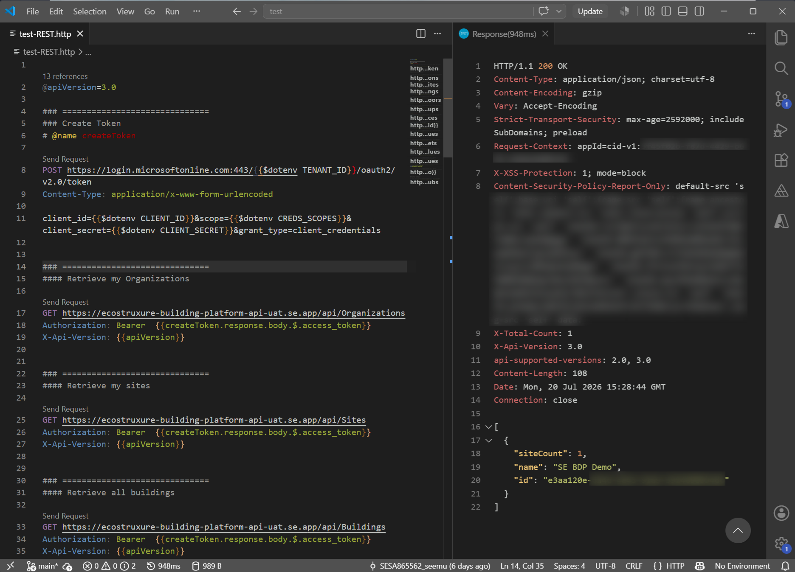
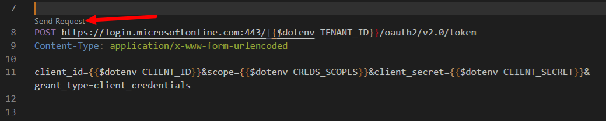

Quand j'ai commencé un rôle avec plusieurs API à apprendre, j'avais besoin d'une façon plus rapide d'explorer les points d'accès, d'enchaîner les appels et d'inspecter les réponses sans avoir à basculer entre les outils.

L'extension VS Code **[REST Client](https://marketplace.visualstudio.com/items?itemName=humao.rest-client)** (`humao.rest-client`) m'a permis de faire exactement ça. Elle te permet d'envoyer des requêtes REST et GraphQL directement depuis des fichiers `.http` dans VS Code.

Dans ce post, je vais partager le flux de travail que j'utilise pour apprendre les API rapidement : garder les requêtes près du code et des notes, réutiliser les valeurs entre les appels, et éviter les copies-collages inutiles.

Pour commencer, crée un fichier `.http` et ajoute tes requêtes dedans. Sépare les requêtes avec `###` ; ce séparateur est ce qui fait apparaître le lien **Send Request** au-dessus de chaque bloc de requête.



Oui, tu peux utiliser l'IA ou des outils comme Postman et Insomnia pour générer les requêtes. Mais quand ton but est d'**apprendre** une API, il est utile de garder tout près de ton code et de tes notes. J'avais déjà VS Code ouvert toute la journée, donc j'ai décidé de garder tout mon flux d'apprentissage des API là.

Dans mon cas, chaque appel API est sécurisé et nécessite un jeton d'accès, donc générer un jeton est l'étape zéro.
Je pourrais coller un jeton au début du fichier, mais cette approche s'effondre rapidement : les jetons expirent, et les valeurs collées peuvent accidentellement être validées ou poussées.

C'est pourquoi je garde les identifiants dans un fichier `.env` local (par exemple : `CLIENT_ID`, `CLIENT_SECRET`, et `TENANT_ID`) qui est listé dans `.gitignore`.

Ensuite, j'ai créé ma première requête pour générer un jeton d'accès à partir de ces valeurs :

```http
POST https://login.microsoftonline.com:443/{{$dotenv TENANT_ID}}/oauth2/v2.0/token
Content-Type: application/x-www-form-urlencoded

client_id={{$dotenv CLIENT_ID}}&scope={{$dotenv CREDS_SCOPES}}&client_secret={{$dotenv CLIENT_SECRET}}&grant_type=client_credentials
```

Explication rapide : chaque expression `{{$dotenv ...}}` lit une valeur depuis ton fichier `.env`, donc tu gardes les secrets en dehors de ton fichier `.http` et hors du contrôle de source.

- `{{$dotenv TENANT_ID}}` -> `TENANT_ID`
- `{{$dotenv CLIENT_ID}}` -> `CLIENT_ID`
- `{{$dotenv CLIENT_SECRET}}` -> `CLIENT_SECRET`

Pour exécuter l'appel, clique sur le lien **Send Request** au-dessus de la requête. La réponse s'ouvre dans un nouvel onglet, et tu peux inspecter le jeton d'accès dans le corps.



Ensuite, tu peux utiliser ce jeton dans la requête suivante :

```http
GET https://ecostruxure-building-platform-api-uat.se.app/api/Sites
Authorization: Bearer {{ACCESS_TOKEN}}
X-Api-Version: {{apiVersion}}
```

Pour éviter les copies-collages de valeurs, une meilleure approche est de nommer les requêtes et de référencer leurs réponses comme variables :

```http
### ==============================
### Créer un jeton
# @name createToken

POST https://login.microsoftonline.com:443/{{$dotenv TENANT_ID}}/oauth2/v2.0/token
Content-Type: application/x-www-form-urlencoded

client_id={{$dotenv CLIENT_ID}}&scope={{$dotenv CREDS_SCOPES}}&client_secret={{$dotenv CLIENT_SECRET}}&grant_type=client_credentials
```

Remarque l'étiquette `@name createToken` qui nomme cette requête. Après son exécution, tu peux accéder aux champs de son corps de réponse. Le contenu de la réponse est du JSON et ressemble à ceci :

```json
{
  "token_type": "Bearer",
  "expires_in": 3599,
  "ext_expires_in": 3599,
  "access_token": "eyJ0..."
}
```

Par exemple, pour récupérer la valeur `access_token`, nous pouvons utiliser l'expression `createToken.response.body.$.access_token`. Quand assignée à une variable, ça ressemble à ceci :

`@ACCESS_TOKEN={{createToken.response.body.$.access_token}}`

Ensuite tu peux utiliser `{{ACCESS_TOKEN}}` dans toutes tes requêtes, comme celle-ci qui récupère tous les bâtiments :

```http
### ==============================
#### Récupérer mes sites
# @name getBuildings

GET https://ecostruxure-building-platform-api-uat.se.app/api/Buildings
Authorization: Bearer {{ACCESS_TOKEN}}
X-Api-Version: {{apiVersion}}
```

Si tu reviens plus tard et que le jeton a expiré, exécute simplement la requête de jeton à nouveau, et la variable `{{ACCESS_TOKEN}}` se mettra automatiquement à jour pour toutes les requêtes suivantes. Aucune copie-collage requise.

## Extraire une valeur d'une réponse avec liste

Et si une réponse retourne plusieurs éléments et que tu as besoin d'un ID spécifique ?
Par exemple, la requête précédente retourne plusieurs bâtiments, mais j'étais intéressé par le bâtiment nommé « Virtual Building FB ». La réponse ressemble à ceci :

```json
[
  {
    "organizationName": "BDP Team",
    "organizationId": "2dd6da1e",
    "siteId": "34580992",
    "floorCount": 1,
    "spaceCount": 2,
    "deviceCount": 0,
    "measurementCount": 0,
    "includesDeviceAndMeasurementCounts": false,
    "name": "Frank Demo Office",
    "referenceId": "frank-demo-building",
    "area": 0.0,
    "metadata": [],
    "id": "4a69071c"
  },
  {
    "organizationName": "BDP Team",
    "organizationId": "2dd6da1e",
    "siteId": "34580992",
    "floorCount": 2,
    "spaceCount": 5,
    "deviceCount": 0,
    "measurementCount": 0,
    "includesDeviceAndMeasurementCounts": false,
    "name": "Virtual Building FB",
    "referenceId": "vir-fb",
    "area": 0.0,
    "metadata": [
      {
        "name": "location",
        "value": "north wing"
      }
    ],
    "id": "01ab96fc"
  }
]
```

Pour obtenir la valeur de la propriété `id` pour un bâtiment avec un nom spécifique, nous pouvons filtrer avec [JSONPath](https://support.smartbear.com/alertsite/docs/monitors/api/endpoint/jsonpath.html) :

`@buildingId={{getBuildings.response.body.$[?(@.name=='Virtual Building FB')].id}}`

Ceci utilise la réponse de la requête précédente (`getBuildings`) et extrait l'`id` correspondant.

> ℹ️ **_NOTE:_** Si c'est ta première fois en voyant JSONPath, lis-le comme ceci :
> 
> - `$` signifie « commence à partir de la racine du corps de réponse ».
> - `[?()]` applique un filtre.
> - `@.name=='Virtual Building FB'` ne garde que les objets où `name` correspond.
> - `.id` retourne le champ `id` de l'objet correspondant.

Ensuite, utilise `{{buildingId}}` dans la requête suivante :

```http
### ==============================
### Récupérer tous les étages dans un bâtiment spécifique
# @name getFloors

GET https://ecostruxure-building-platform-api-uat.se.app/api/Buildings/{{buildingId}}/Floors
Authorization: Bearer {{ACCESS_TOKEN}}
X-Api-Version: {{apiVersion}}
```

## Variables dynamiques

Les autres variables dynamiques intégrées incluent :

- {{$guid}}
- {{$randomInt min max}}
- {{$timestamp [offset option]}}
- {{$datetime rfc1123|iso8601 [offset option]}}
- {{$localDatetime rfc1123|iso8601 [offset option]}}
- {{$processEnv [%]envVarName}}
- {{$dotenv [%]variableName}}
- {{$aadToken [new] [public|cn|de|us|ppe] [<domain|tenantId>] [aud:<domain|tenantId>]}}

Pour une requête de données historiques, j'avais besoin de passer une date-heure dans un format très spécifique.
J'ai résolu ça en générant la valeur avec une variable dynamique :

`@currentTimestamp={{$datetime 'YYYY-MM-DDTHH:mm:ss.SSS[000][Z]' -5 h}}`

Ensuite j'ai passé `{{currentTimestamp}}` dans le paramètre de la requête suivante.

## Appeler GraphQL depuis REST Client

La plupart des exemples ci-dessus utilisent des requêtes GET, mais tu peux aussi envoyer des requêtes POST et des requêtes GraphQL.

Par exemple, pour obtenir un bâtiment avec ses niveaux et salles :

```http
### GRAPH: bâtiments & équipement
POST https://ecostruxure-building-platform-api-uat.se.app/graphql
Content-Type: application/json
Authorization: {{ACCESS_TOKEN}}
X-REQUEST-TYPE: GraphQL
X-Api-Version: {{apiVersion}}

query MyQuery {
  buildings(where: {name: {eq: "Frank Demo Office"}}) {
    id
    name
    levels {
      name
      rooms {
        name
      }
    }
  }
}
```

Ici nous utilisons POST parce que la requête GraphQL est envoyée dans le corps de la requête.

La réponse ressemble à :

```json
{
  "data": {
    "buildings": [
      {
        "id": "4a69071c",
        "name": "Frank Demo Office",
        "levels": [
          {
            "name": "Ground Floor",
            "rooms": [
              {
                "name": "Open Office Space"
              },
              {
                "name": "Terrasse"
              }
            ]
          }
        ]
      }
    ]
  }
}
```

GraphQL est puissant ici parce que tu peux demander les données associées en un seul appel au lieu d'enchaîner plusieurs points d'accès REST.

En résumé : si tu apprends une nouvelle API, REST Client t'aide à avancer plus rapidement avec moins de changements de contexte. Garde tes requêtes dans un fichier `.http`, réutilise les valeurs avec `@name` + `{{...}}`, et itère directement dans VS Code.

Dernièrement, ce flux de travail a été encore plus utile alors que mon travail quotidien inclut des discussions de plateforme plus larges et des cycles de découverte plus rapides.

Si utile, je peux partager un modèle de démarrage `.http` suivi que tu peux adapter à tes propres API.


#### Références utiles :

- [Documentation de l'extension REST Client](https://github.com/Huachao/vscode-restclient)
- [Aperçu de la syntaxe JSONPath](https://support.smartbear.com/alertsite/docs/monitors/api/endpoint/jsonpath.html)
