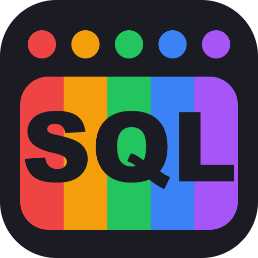
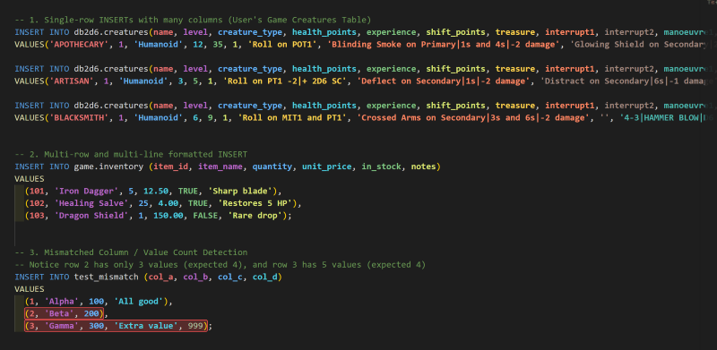
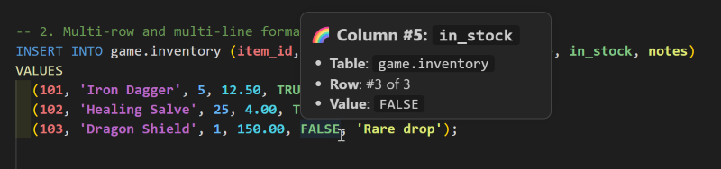
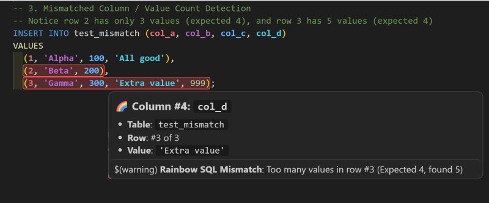

<p align="center">
  
</p>
J'ai une confession à vous faire. Pendant des années, chaque fois que je devais écrire ou modifier une instruction SQL `INSERT`, je faisais la même petite danse : placer mon curseur sur une valeur, compter les virgules, remonter jusqu'à la liste des colonnes, recompter, et espérer être tombé à la bonne place. Ensuite, je changeais la valeur... sans être sûr à 100 % que c'était la bonne colonne.
 
Avec trois ou quatre colonnes, ça va. Mais donnez-moi une table de quinze colonnes avec quelques lignes de données, et me voilà de retour à l'école, en train de compter sur mes doigts.
 
Alors j'ai créé **Rainbow SQL**, ma toute première extension VS Code. 🎉
 
## L'idée : des couleurs qui concordent, tout simplement
 
L'idée était simple. Si chaque colonne avait sa propre couleur, et que chaque valeur utilisait la même couleur que sa colonne, je n'aurais plus besoin de compter quoi que ce soit. Je pourrais simplement le *voir*.
 
Voici de quoi ça a l'air :
 

 
`health_points` est en bleu, donc la valeur en bleu, ce sont les points de vie. C'est tout. Fini le comptage de virgules.
 
Ça fonctionne autant si votre instruction tient sur une seule longue ligne que si elle est bien formatée sur plusieurs lignes, avec plusieurs rangées :
 
```sql
INSERT INTO items (id, code, price)
VALUES
  (101, 'ITEM_A', 19.99),
  (102, 'ITEM_B', 24.50);
```
 
Chaque `id` a la même couleur, chaque `code` a la même couleur, et ainsi de suite, jusqu'en bas.
 
## « Mais c'est quelle colonne, au juste? »
 
Les couleurs, c'est super, mais des fois on veut en être certain. J'ai donc ajouté une petite fenêtre au survol. Passez votre souris sur n'importe quelle valeur et Rainbow SQL vous indique le numéro de la colonne, son nom, la table, et la rangée où vous êtes.
 

 
Et si vous êtes plutôt du genre clavier (comme moi la plupart du temps), la colonne active s'affiche aussi dans la barre d'état pendant que vous déplacez votre curseur dans l'instruction.
 
## Un petit bonus : repérer les incohérences
 
En développant l'extension, je retombais sans cesse sur une autre erreur classique : une valeur de trop, ou une valeur manquante. Vous savez, le genre d'erreur qui n'apparaît qu'au moment d'exécuter le script... et évidemment, c'est à la rangée 47.
 
Soyons clairs : Rainbow SQL n'est **pas** un validateur SQL, et ce n'est pas son but. Mais quand le nombre de valeurs dans une rangée ne correspond pas au nombre de colonnes déclarées, la rangée est surlignée en rouge pour que vous la repériez tout de suite.
 

 
Il manque une valeur à la rangée 2, et la rangée 3 en a une de trop. Les deux sautent aux yeux immédiatement.
 
## Le reste des petites gâteries
 
Voici un tour rapide de tout ce qu'on y trouve :
 
- **Couleurs concordantes entre colonnes et valeurs** pour suivre chaque colonne à travers une ou plusieurs rangées `VALUES`.
- **Instructions sur une ou plusieurs rangées**, sur une seule ligne ou sur plusieurs.
- **Détails de la colonne au survol** : numéro, nom, table et position de la rangée.
- **Colonne active dans la barre d'état** pendant que vous vous déplacez dans une instruction.
- **Détection des incohérences** pour les rangées qui ont trop ou pas assez de valeurs.
- **Couleurs adaptées au thème**, avec des palettes distinctes pour les thèmes clair et sombre. Et oui, vous pouvez les personnaliser.
- **Analyse qui comprend le SQL** : valeurs entre guillemets, commentaires, expressions imbriquées et les styles habituels de délimitation des identifiants.
L'extension s'active pour les fichiers SQL, PostgreSQL, MySQL, PL/SQL, T-SQL et SQLite. Et si jamais vous avez besoin d'une pause de l'arc-en-ciel, lancez **Rainbow SQL: Toggle Rainbow SQL Highlighting** depuis la palette de commandes.
 
## Essayez-la (et dites-moi ce que vous en pensez!)
 
Rainbow SQL est gratuite et disponible dès maintenant sur le Visual Studio Marketplace :
 
👉 **[Rainbow SQL sur le Visual Studio Marketplace](https://marketplace.visualstudio.com/items?itemName=fboucher.rainbow-sql)**
 
Vous pouvez aussi l'installer directement dans VS Code : ouvrez la vue Extensions (`Ctrl+Shift+X`), cherchez **Rainbow SQL**, puis cliquez sur Install.
 
Si elle vous évite quelques minutes de comptage de virgules, j'apprécierais vraiment que vous **laissiez un avis sur le Marketplace**. C'est ma première extension, alors chaque note et chaque commentaire comptent beaucoup pour moi, en plus d'aider d'autres personnes à la découvrir. ⭐
 
Vous avez trouvé un bogue ou vous avez une idée? Le code est sur GitHub à [fboucher/vscode-rainbow-sql](https://github.com/fboucher/vscode-rainbow-sql), et les *issues* sont les bienvenues.
 
Bon code (en couleurs🌈)! 